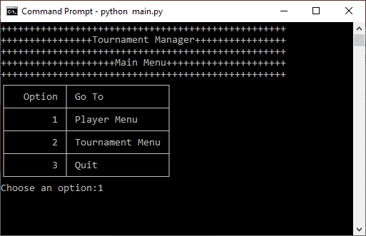
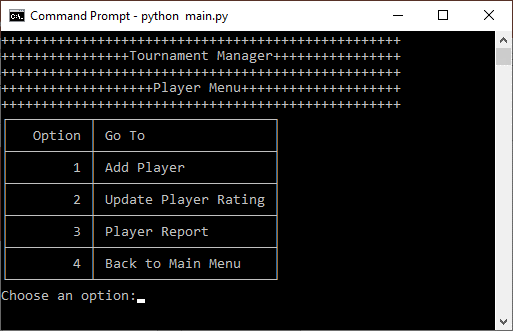
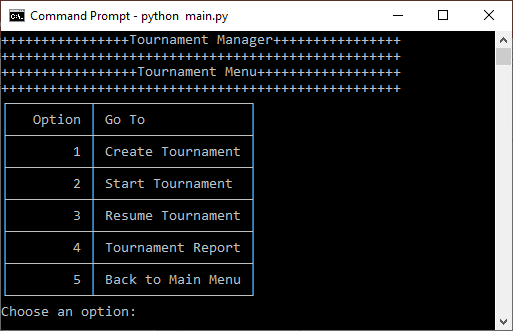

# Develop a Software Program Using Python

**OpenClassrooms - Python Developer Path:** Project 4

**Student:** Abdoul Baki Seydou

**Date:** 31/12/2022 

## Table of Contents
1. [Summary](#summary)
2. [Features](#features)
3. [Basic flow](#basic-flow)
4. [Technologies Used](#technologies-used)
5. [Project Tasks](#project-tasks)
6. [Local Development](#local-development)
   - [Prerequisites](#prerequisites)
   - [Setup on macOS/Linux](#setup-on-macoslinux)
   - [Setup on Windows](#setup-on-windows)
   - [Running the Application](#running-the-application)
   - [Linting](#linting)
   - [Screenshots](#screenshots)

## Summary
In this project, as a junior freelance developer presented with the first opportunity of a potential client project,
the task consists of creating a standalone tournament management application for a local chess club, **Castle Chess**, 
that allows the tournament managers to run the entire events offline.

## Features
1. **Players:** Add players and update their ratings.
2. **Tournaments:** Create, start and resume tournaments.
3. **Player Pairings:** Using the  Swiss tournament system.
4. **Reports:** Display reports on players, tournament's rounds and matches.

## Basic flow
1. Create players.
2. Create a new tournament.
3. Add eight players in the tournament.
4. Start the tournament created and run the rounds.
5. The application generates the pairings automatically.
6. Input match scores: the winner receives 1 point, the loser 0, and 0.5 each for a tie.

## Technologies Used
- **Programming Language:** Python  
- **Libraries:** tabulate.
- **Database:** TinyDB, in Json format.

## Project Tasks
1. Design Models.
2. Create the menu Views then the Controllers handling the logic of the view.

## Local Development

### Prerequisites
- Python 3.6 or higher.

### Setup on macOS/Linux

1. **Clone the Repository**
   ```bash
   cd /path/to/put/project/in
   git clone https://github.com/Afudu/P4_OpenClassroom.git

2. **Move to the folder**
   ```bash
   cd P4_OpenClassroom

3. **Set Up Virtual Environment**
   ```bash
   python -m venv venv
   
4. **Activate Environment**
   ```bash
   source venv/bin/activate 

5. **Securely upgrade pip**
   ```bash
   python -m pip install --upgrade pip 

6. **Install dependencies**
   ```bash
   pip install -r requirements.txt
   
7. **To deactivate Environment**
   ```bash
   deactivate

### Setup on Windows

1. Follow the steps above.

2. To activate the environment:
   ```bash
   .\venv\Scripts\Activate

### Running the application

- To run the application:
   ```bash
   python main.py


### Linting

- To run Linting
  ```bash
  flake8
  
## Screenshots





